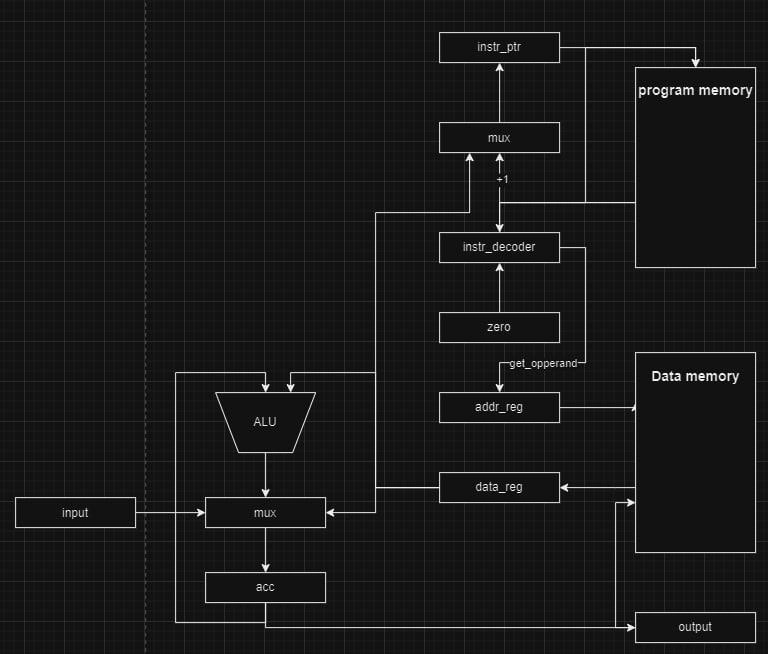

# Лабораторная работа #3
Степанов Артур P33131

Вариант: `alg | cisc | harv | hw | tick | struct | stream | port | cstr | prob2 | [4]char`


## Структура проекта
Исполняемые файлы:
- `bin/translator.py` - бинарник, получающий на вход код `.asm`, а выводит бинарник `.out`
- `bin/run.py` - виртуальная машина, которая исполняет код, на вход получает `.out` и файл с входными данными `.txt`

Прочее:
- `machine/isa.py` - instruction set architecture, описывает опкоды и архитектуру команд
- `machine/simulation.py` - реализацию виртуальной машины
- `machine/translator.py` - реализация транслятора из ассемблера в машинный код


## Описание языка
Упрощённый язык ассемблера в расширенной форме Бэкуса — Наура:
```
<letter> ::= "A" | "B" | "C" | "D" | "E" | "F" | "G"
       | "H" | "I" | "J" | "K" | "L" | "M" | "N"
       | "O" | "P" | "Q" | "R" | "S" | "T" | "U"
       | "V" | "W" | "X" | "Y" | "Z" | "a" | "b"
       | "c" | "d" | "e" | "f" | "g" | "h" | "i"
       | "j" | "k" | "l" | "m" | "n" | "o" | "p"
       | "q" | "r" | "s" | "t" | "u" | "v" | "w"
       | "x" | "y" | "z" | "_"
<name> ::= <letter> <name> | <letter>
<label> ::= "$" <name> | "." <name> | <name>

<digit> ::= "0" | "1" | "2" | "3" | "4" | "5" | "6" | "7" | "8" | "9" 
<number> ::= <digit> <number> | <digit>

<empty_expr> ::= "\n"

<op_0_arg> ::= "hlt" | "in" | "out"
<op_1_arg> ::= "st" | "ld" | "add" | "mul" | "div" | "mod" | "cmp" | "jmp" | "je" | "word" | "db"
<label_def> ::= <name> ":" | "section .text" | "section .data"

<line> ::= <label_def> | <op_0_arg> | <op_1_arg> " " <label> |  <op_1_arg> " " <label> | <empty_expr>

<program> ::= <line> <program> | <line>
```


## ISA/mnemonics

У операндов поддержано три режима адресации:

| мнемоника          | количество тактов                                                                            |
|:-------------------|:---------------------------------------------------------------------------------------------|
| `CONSTANT`         | операнд хранится непосредственно в команде                                                   |
| `DIRECT_ADDRESS`   | операнд - это значение, лежащее по адресу, хранящемся в команде                              |
| `INDIRECT_ADDRESS` | операнд - это значение, лежащее по адресу, хранящемся в ячейке, на которую указывает команда |


Система команд:

| мнемоника | минимальное количество тактов | тип операнда                      | описанаие команды                           |
|:----------|-------------------------------|:----------------------------------|:--------------------------------------------|
| `out`     | 2                             | `-`                               | распечатать в output stream значение из acc |
| `in`      | 2                             | `-`                               | прочитать в acc значение из input stream    |
| `hlt`     | -                             | `-`                               | поставить процессор на паузу                |
| `ld`      | 2                             | `const/direct_addr/inderect_addr` | загрузить значение в acc                    |
| `st`      | 2                             | `direct_addr/inderect_addr`       | сохранить значение из acc в память          |
| `add`     | 2                             | `const/direct_addr/inderect_addr` | прибавить к acc аргумент                    |
| `mul`     | 2                             | `const/direct_addr/inderect_addr` | умножить acc на значение                    |
| `div`     | 2                             | `const/direct_addr/inderect_addr` | целочисленно поделить acc на значение       |
| `mod`     | 2                             | `const/direct_addr/inderect_addr` | получить остаток от деления acc на значение |
| `cmp`     | 1                             | `const/direct_addr/inderect_addr` | сравнить acc со значением                   |
| `jmp`     | 1                             | `direct_addr`                     | безусловный переход на аргумент-метку       |
| `je`      | 1                             | `direct_addr`                     | переход на аргумент-метку, если равно       |


## Транслятор
Транслирует код на языке ассемблера в машинные инструкции (`.json`)


Пример исходного кода `hello.asm`:
```asm
section .data
    curr_char: word 1
    hellow: db "hello world"
    null_term: word 0

section .text
    print:
        ld $curr_char  ; загружаю символ по адресу curr_char
        cmp #0  ; сравниваю, закончилась ли строка
        je .exit
        out
        ld curr_char
        add #1
        st curr_char
        jmp .print
    exit:
        hlt

```

Результат трансляции `hello.out`:
```json
{
    "data": [
        1,
        104,
        101,
        108,
        108,
        111,
        32,
        119,
        111,
        114,
        108,
        100,
        0
    ],
    "code": [
        [
            "ld",
            [
                "indirect_address",
                0
            ]
        ],
        [
            "cmp",
            [
                "constant",
                0
            ]
        ],
        [
            "je",
            [
                "constant",
                8
            ]
        ],
        [
            "out",
            null
        ],
        [
            "ld",
            [
                "direct_address",
                0
            ]
        ],
        [
            "add",
            [
                "constant",
                1
            ]
        ],
        [
            "st",
            [
                "constant",
                0
            ]
        ],
        [
            "jmp",
            [
                "constant",
                0
            ]
        ],
        [
            "hlt",
            null
        ]
    ]
}
```


## Модель процессора



Особенности процессора:
- Все операции построены вокруг аккумулятора `acc`, участвует в вводе-выводе
- Ввод-вывод осуществляется посимвольно через порты
- Машинное слово размером в 32 бит
- `instr_ptr` - счетчик инструкций, указывает на адрес исполняемой команды
- Реализована Гарвардская архитектура, две отдельные памяти для команд и для данных:
  - память команд:
    - `instr_ptr` - счетчик инструкций, указывает на адрес исполняемой команды
  - память данных:
    - `addr_reg` - для хранения адреса ячейки в памяти команд (по какому адресу читать/писать)
    - `data_reg` - для хранения слова из памяти данных или записи в память данных
